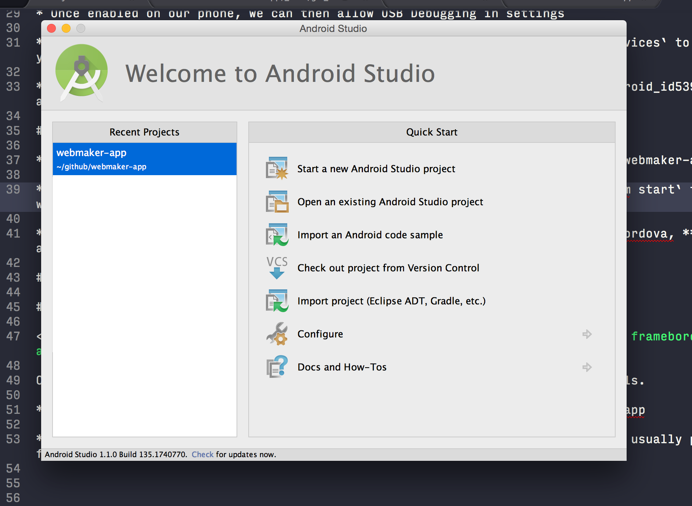
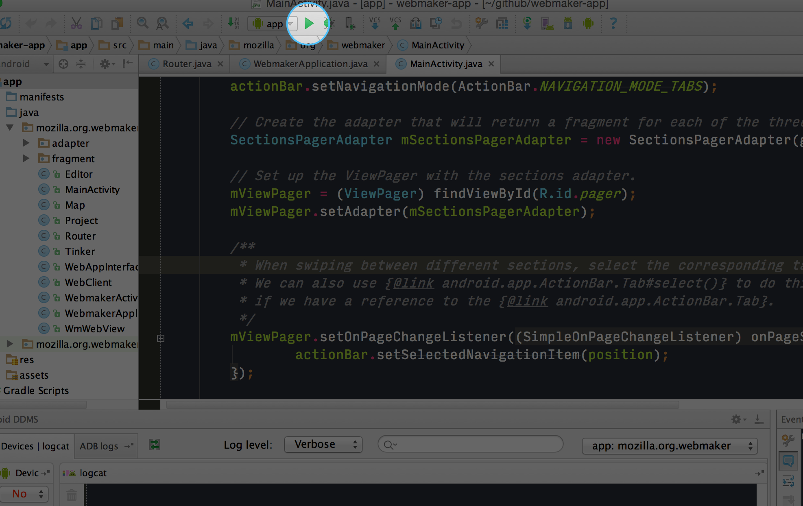

# Developing on Android

* [Install Android Studio](#install-android-studio)
    * The first step of getting set up for Android development is installing Android Studio
* [USB Debugging](#turn-on-remote-usb-debugging-on-your-device)
    * USB debugging allows us to setup your phone to be used as a test device for your app
* [Setup Webmaker App](#set-up-webmaker-app)
    * All the steps needed to get a local version of the Webmaker App repository running locally on your Android phone
* [Chrome Remote Debugging](#chrome-remote-debugging)
    * This will help you start debugging our app using the Chrome developer tools
* [Manually install adb and Android SDK](#install-android-19-4.4-sdk-platform)
    * Only do this if you're unable to use adb after install Android Studio, or you want to manually install other SDKs

## Install Android Studio

You will need to make sure you have **Java 1.7** and [JDK](http://www.oracle.com/technetwork/java/javase/downloads/jdk7-downloads-1880260.html) installed for your platform.

You can download Android Studio from [https://developer.android.com/sdk](https://developer.android.com/sdk/index.html). This might take a while.

After it has installed successfully, you should see the following screen:



## Turn on remote USB debugging on your device

<iframe width="775" height="436" src="https://www.youtube.com/embed/idRdI2iN2Ek" frameborder="0" allowfullscreen></iframe>

* In order to get started testing apps on a phone, we need to first enable developer mode by tapping the Build number 7 times in `Settings > About`

* Once enabled on our phone, we can then allow USB Debugging in settings

* This will allow us to plug our phone into our computer via USB and run `adb devices` to make sure your device is recognized

* [This guide](http://www.phonearena.com/news/How-to-enable-USB-debugging-on-Android_id53909) has additional information on setting up your phone for USB Debugging

## Set up Webmaker App

* Clone the Webmaker App repo [mozilla/webmaker-app](https://github.com/mozilla/webmaker-app)

* Once we have a local copy of the `webmaker-app` run `npm install` and then `npm start` to build/watch changes

* In Android studio, choose "Open an existing Android project"

* Select the webmaker-app folder, and press open

* You may need to set your Gradle path to `/Application/Android Studio.app/Contents/gradle/gradle-2.2.1`

* Connect your device via USB, and press the "run" button:




## Manually install adb and Android SDK

If you installed Android Studio, you can probably **skip these steps**.

### Install adb (Android Debug Bridge)

<iframe width="775" height="436" src="https://www.youtube.com/embed/-d28E21PuRc" frameborder="0" allowfullscreen></iframe>

For this project we will need the SDK command line tools. We can download and install from [developer.android.com](https://developer.android.com/sdk/index.html) or via brew:

```bash
brew install android-platform-tools
```

Depending on where you have installed it, you may need to add the following to your .bash_profile:  (`ANDROID_HOME` should refer to wherever you installed the SDK)

```bash
export ANDROID_HOME=~/Library/Android/sdk
export PATH=${PATH}:$ANDROID_HOME/tools:$ANDROID_HOME/platform-tools
```

Open a new window and type:
```
adb version
```
If you see something like `Android Debug Bridge version 1.0.32` you have adb installed properly. If you don't, see [this page on MDN](https://developer.mozilla.org/en-US/Firefox_OS/Debugging/Installing_ADB) for more help.


### Install Android 19 (4.4) SDK platform

If you installed Android Studio, you can probably **skip this step**.

<iframe width="775" height="436" src="https://www.youtube.com/embed/10XXnYteAqA" frameborder="0" allowfullscreen></iframe>

To run our app we'll need to download Android 19. To do this we'll download the SDK manager from [developer.android.com](https://developer.android.com/sdk/index.html).

We'll also need to make sure Java and Java Development Kit are installed in order to run the `Android` command.
