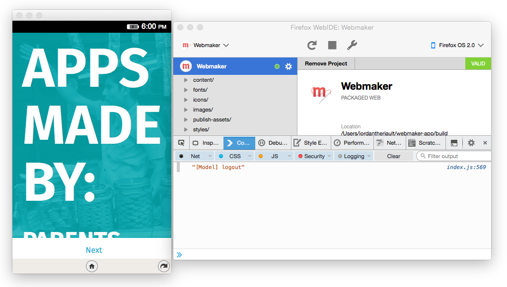

# Developing Mobile Webmaker with Firefox WebIDE

###Overview

Firefox WebIDE allows you to emulate Firefox OS using your browser and run Firefox OS applications for testing. It also includes a debugging tool.

###Install Firefox Developer Edition

In order to use Firefox WebIDE, you need to have [Firefox Developer Edition](https://www.mozilla.org/en-US/firefox/developer/) installed.

###Opening WebIDE

In the Web Developer menu, click on the WebIDE entry and the WebIDE opens. 

You can also use the keybinding: 

*Mac*: Shift-fn-F8.

*Windows*: Shift-F8

###Installing Firefox OS Simulator

1. On the top right, select `Select Runtime -> Install Simulator` and from the list install "Firefox OS 2.0 Simulator"
2. Press "Close" in the top right to get back to the first screen

###Select Mobile Webmaker Project

1. On the top left select `Open App -> Open Packaged App`
2. Select `webmaker-app -> build` 
3. The application information should appear on the screen with a green "Valid" in the top right.

*Note:* You **must** select the build folder for the simulator to work.

###Run Mobile Webmaker

1. Select run the Simulator by selecting it from "Select Runtime" on the top right of the window.
2. Press "Install and Run" 

###Debugging Tool

The debugging tool can be accessed by pressing the pause button  while the application is running.

###Learn More

For more information on the WebIDE, [check out this page](https://developer.mozilla.org/en-US/docs/Tools/WebIDE).
